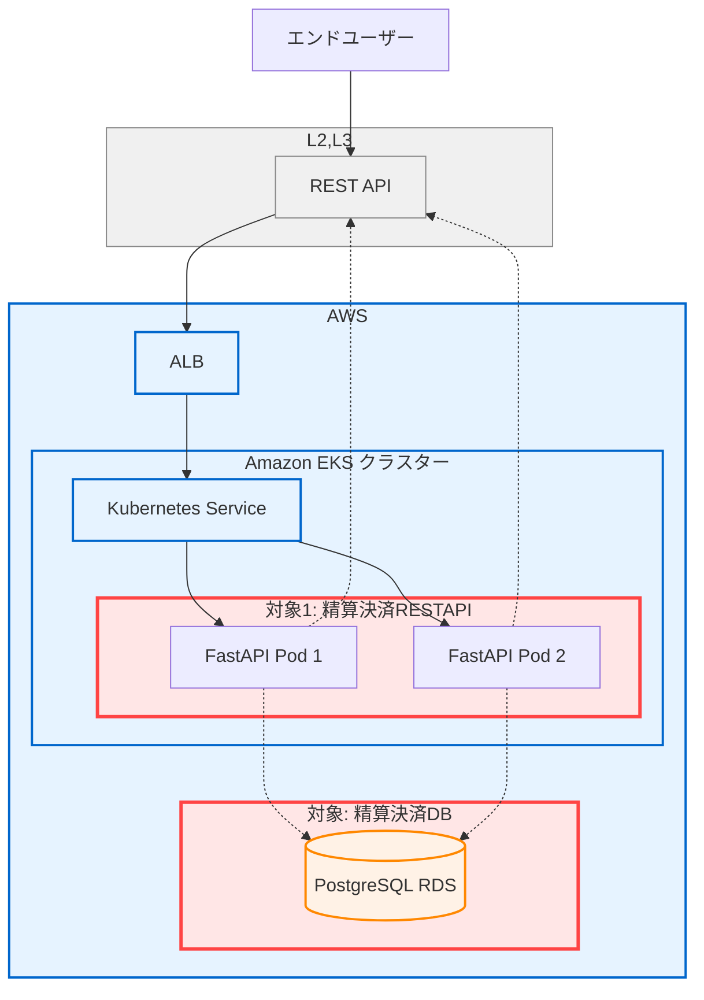
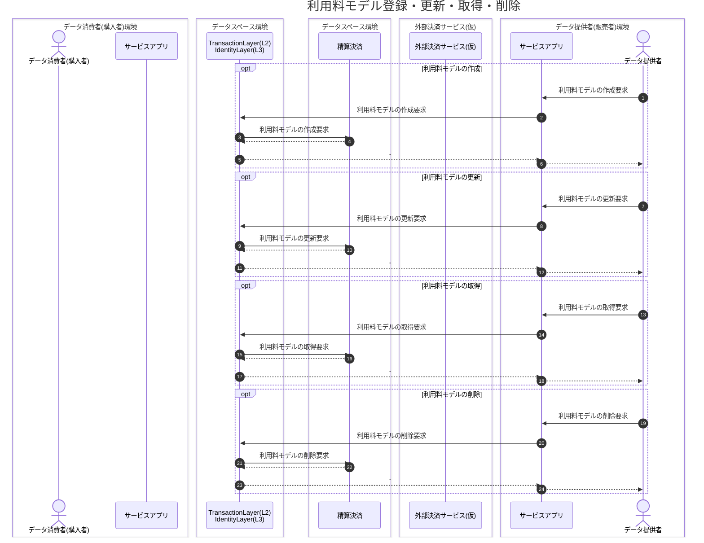
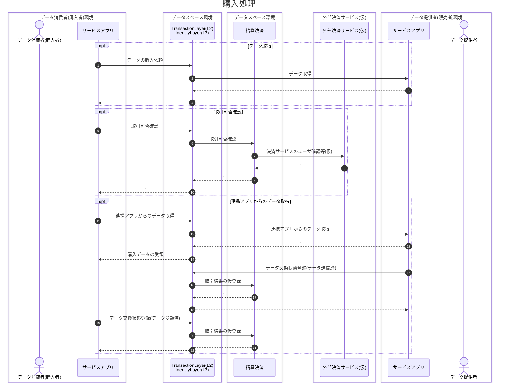
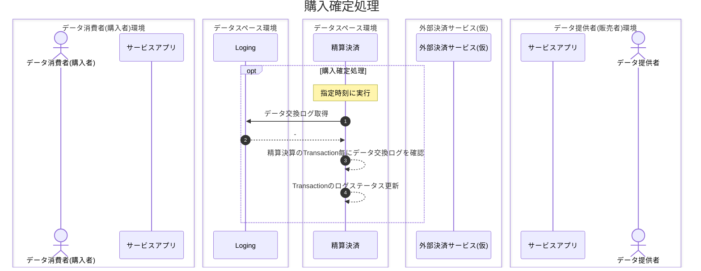
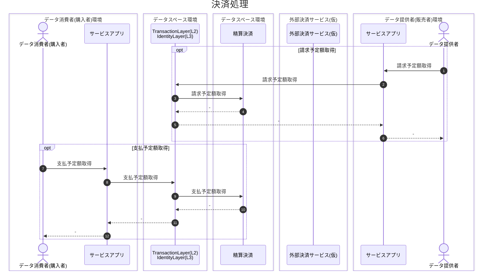
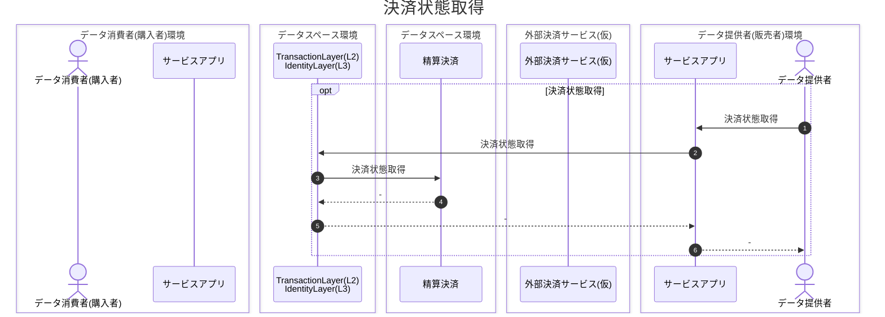
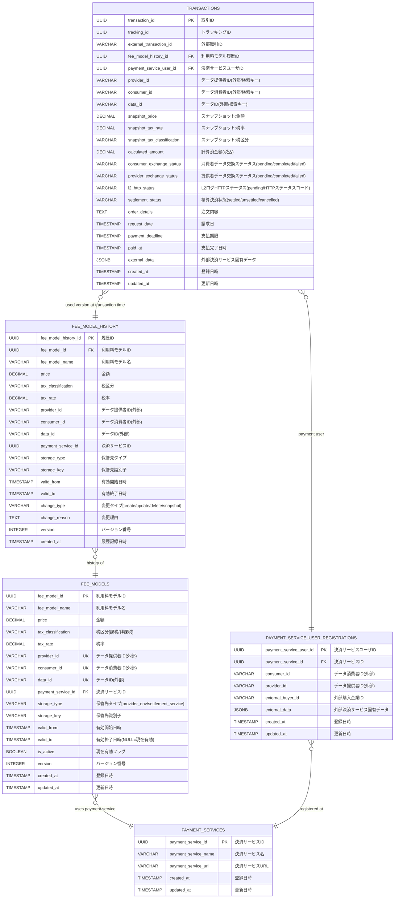

# 精算決済 基本設計

## 1. システム概要

### 1.1 目的・背景

本ソフトウェアは、ウラノス・エコシステム・データスペーシズのデータスペースコンプリメンタリサービス（Dataspace Complementary Services：DCS）の一つとして、データ連携における精算決済機能を担うソフトウェアである。データ提供者・消費者間の取引を記録し、外部決済サービスと連携した利用量と料金モデルに基づく精算決済をサポートする。

### 1.2 適用範囲 / 非対象

* **対象**: 精算決済のAPIサーバ、精算決済データ管理のデータベースが対象
* **非対象**: 非対象: 認証機能は、L3 Identity Component、データ送受信機能は、L2 Transactionの機能のため対象外。また、決済処理も対象外。

### 1.3 システム構成概要
- **APIフレームワーク**: FastAPI (Python 3.11+)
- **データベース**: PostgreSQL 18
- **コンテナ基盤**: Docker / Kubernetes

### 1.4 前提・制約

* 認証機能は、アイデンティティレイヤ（L3）との連携を前提とするため、本システムの対象外
* 通信は **TLS** 前提（Ingress で終端、Pod→DB も TLS）。
* TLS終端は、本ソフトウェアの外部で行うため対象外
* 認可ポリシーは OpenFGAを使用し管理
* 外部決済サービスとの連携は、検証のみとする。

---

## 2. アーキテクチャ

### 2.1 全体構成と対象


### 2.2 主要コンポーネントと責務

* 精算決済APIと精算決済DBが本ソフトウェアの対象
* 精算決済APIは、EKS(Kubernetes)上のPodとして動作する。
* 精算決済DBは、AWSのRDS(PostgreSQL)として動作し、精算決済情報を保持する
* 認証は、L3 Identity ComponentのKeyCloakの認証機能を使用する。
* 精算決済APIは、L2 Transactionを介して呼び出される。


## 3. シーケンス

### 3.1 利用料モデル登録・更新・取得・削除シーケンス



### 3.2 購入処理シーケンス



### 3.3 購入確定処理シーケンス

- Loggingからのログ出力タイミングに合わせて、購入確定処理を実行する。


### 3.4 決済処理シーケンス

- 消費者からのデータ交換ステータスが交換完了、提供者からのデータ交換ステータスが交換完了、データ交換ログのステータスが成功、となったTrasactionを請求予定額、支払い予定額の対象とする。


### 3.5 決済状態取得シーケンス

- データ提供者が、指定したデータ消費者との取引情報について、期間・精算決済状態で絞り込み、取得する。


## 4. API 設計（概要）

### 4.1 共通仕様

* **API方式**: REST API
* **Base URL**: `/api/v1`
* **バージョン管理**: URL版管理方式（/v1）
* **認証**: `Authorization: Bearer <JWT>`
* **リクエスト形式**: 
  - Content-Type: `application/json`
  - 文字エンコーディング: UTF-8
* **レスポンス形式**: 
  - Content-Type: `application/json; charset=utf-8`
  - エラーレスポンス: RFC 9457 準拠
* **日時フォーマット**: ISO 8601 (YYYY-MM-DDTHH:mm:ss.sssZ)

### 4.2 REST API エンドポイント

| メソッド   | パス                                 | 説明                      |
| ------ | ---------------------------------- | ----------------------- |
| GET    | `/api/v1/fee-model`             | 利用料モデル一覧取得 |
| POST    | `/api/v1/fee-model`             | 利用料モデル登録 |
| PUT    | `/api/v1/fee-model/{fee_model_id}`             | 利用料モデル変更 |
| DEL    | `/api/v1/fee-model/{fee_model_id}`             | 利用料モデル削除 |
| POST    | `/api/v1/data-exchange/transaction/eligibility`             | 取引可否確認 |
| POST    | `/api/v1/data-exchange/non-fee-model/transaction/eligibility` | 取引可否確認（利用料モデルなし） |
| POST    | `/api/v1/data-exchange/non-fee-model/confirm`               | データ交換取引金額確定（利用料モデルなし） |
| POST    | `/api/v1/data-exchange/status`             | データ交換状態登録 |
| PUT    | `/api/v1/data-exchange/status`             | データ交換状態更新 |
| POST    | `/api/v1/data-exchange/settlement/transactions`             | 決済状態取得 |
| POST    | `/api/v1/payment`             | 支払予定額取得 |
| POST    | `/api/v1/billing`             | 請求予定額取得 |


### 4.3 エラーレスポンス

#### (1) ステータスコード

| コード | 説明 | 対象メソッド | 備考 |
|-------|------|------------|------|
| 400 | Bad Request 不正なリクエスト | すべて | 他の400番台に相応しいコードがない場合に使用 |
| 401 | Unauthorized　認証失敗 | すべて | アクセストークン検証に失敗した場合 |
| 403 | Forbidden　認可失敗 | すべて | 認可チェックにより該当ユーザにAPI実行権限がない場合 |
| 404 | Not Found　指定したリソースはない | すべて | APIにて指定したリソースがない場合、※利用料モデル登録は新規登録のため対象外|
| 409 | Conflict　リソースの競合 | POST(※POSTは更新系APIのみ対象。検索APIなどの取得系POSTは対象外), PUT, DELETE | 既に存在するリソースとの競合や、リソースの状態による処理不可の場合|
| 422 | Validation Error バリデーションエラー | すべて | リクエスト形式は正しいが、セマンティックエラーがある場合|
| 500 | Internal Server Error システムエラー | すべて | サーバ起因のエラー |

#### (2) レスポンスボディ
- RFC 9457 に準拠する
```json
{
  "type": "/ouranos/errors/validation-error", # URI形式のエラーコード
  "title": "エラー名称", # エラー名称 
  "detail": "xxx...", # エラーの説明
  "instance": "/api/v1/xx", # 問題の発⽣したリソースのURI
  "status": 403　# ステータスコード
}
```

---

## 5. 認証・認可設計

### 5.1 認証、認可前提

- 認証は、 L3 Identity Componentにて実施。本ソフトウェアの対象外。
- L3 Identity Componentとの認証フローにより取得したアクセストークンを使用し、本ソフトウェアのAPIを実行する。
- L3 Identity Componentとの認証フローは、利用ユーザの場合は、認可コードフローにより認証を行い取得したアクセストークンを利用する。
- L3 Identity Componentとの認証フローは、ユーザシステムの場合(人を介在しない場合)は、クレデンシャルフローにより認証を行い取得したアクセストークンを利用する。
- 各APIのAuthorizationヘッダに付与されたアクセストークンを元に、利用ユーザまたは、ユーザシステムを特定し、認可情報をチェック後、該当する通知情報を返却する。
- 認可機能は、精算決済機能とは別にOpenFGAを構築し、認可登録、認可チェックを行うことを前提とする。

### 5.2 認可機能

- 認可対象
  - 精算決済の各API

- 認可登録
  - 事前にユーザ(operator_id)単位で、精算決済のどのAPIに対してアクセス可能とするかを登録する。
  - 認可登録は、認可機能(OpenFGA)のAPIを実行して登録する。

- 認可確認
  - 精算決済の各API内で、アクセストークンを確認し、operator_idを取得
  - 精算決済の各APIから認可機能に該当operator_idが対象の精算決済APIに対して認可登録がされているかを問い合わせる。
  - 認可されている場合は、APIを実行。
  - 認可されていない場合は、403エラーを返す。


## 6. データ設計

* 精算決済機能内で保持するデータのエンティティ一覧とER図を下記に示す。

## 6.1. エンティティ一覧

### 6.1.1 利用料モデル `FEE_MODELS`

* 利用料モデルID `fee_model_id`（必須・主キー・UUID）
* 利用料モデル名 `fee_model_name`（必須・VARCHAR）
* 金額 `price`（必須・DECIMAL・マイナス値を許容）
* 税区分 `tax_classification`（必須・VARCHAR・課税/非課税）
* 税率 `tax_rate`（必須・DECIMAL）
* データ提供者ID `provider_id`（必須・VARCHAR・外部システム）
* データ消費者ID `consumer_id`（必須・VARCHAR・外部システム）
* データID `data_id`（必須・VARCHAR・外部システム）
* 決済サービスID `payment_service_id`（必須・外部キー・UUID）
* 保管先タイプ `storage_type`（必須・VARCHAR・provider_env/settlement_service）
* 保管先識別子 `storage_key`（必須・VARCHAR）
* 有効開始日時 `valid_from`（必須・TIMESTAMP）
* 有効終了日時 `valid_to`（任意・TIMESTAMP・NULL=現在有効）
* 現在有効フラグ `is_active`（必須・BOOLEAN）
* バージョン番号 `version`（必須・INTEGER）
* 登録日時 `created_at`（必須・TIMESTAMP）
* 更新日時 `updated_at`（必須・TIMESTAMP）
* ユニーク制約：`UNIQUE(provider_id, consumer_id, data_id) WHERE is_active = TRUE`

### 6.1.2 利用料モデル履歴 `FEE_MODEL_HISTORY`

* 履歴ID `fee_model_history_id`（必須・主キー・UUID）
* 利用料モデルID `fee_model_id`（必須・外部キー・UUID）
* 利用料モデル名 `fee_model_name`（必須・VARCHAR）
* 金額 `price`（必須・DECIMAL）
* 税区分 `tax_classification`（必須・VARCHAR）
* 税率 `tax_rate`（必須・DECIMAL）
* データ提供者ID `provider_id`（必須・VARCHAR・外部システム）
* データ消費者ID `consumer_id`（必須・VARCHAR・外部システム）
* データID `data_id`（必須・VARCHAR・外部システム）
* 決済サービスID `payment_service_id`（必須・UUID）
* 保管先タイプ `storage_type`（必須・VARCHAR）
* 保管先識別子 `storage_key`（必須・VARCHAR）
* 有効開始日時 `valid_from`（必須・TIMESTAMP）
* 有効終了日時 `valid_to`（必須・TIMESTAMP）
* 変更タイプ `change_type`（必須・VARCHAR・create/update/delete/snapshot）
* 変更理由 `change_reason`（任意・TEXT）
* バージョン番号 `version`（必須・INTEGER）
* 履歴記録日時 `created_at`（必須・TIMESTAMP）

### 6.1.3 取引 `TRANSACTIONS`

* 取引ID `transaction_id`（必須・主キー・UUID）
* トラッキングID `tracking_id`（必須・UUID・INDEX）
* 外部取引ID `external_transaction_id`（任意・VARCHAR・外部決済サービスのレスポンスから取得）
* 利用料モデル履歴ID `fee_model_history_id`（任意・外部キー・UUID・利用料モデル無しの場合NULL）
* 決済サービスユーザID `payment_service_user_id`（任意・外部キー・UUID・利用料モデル無しの場合NULL）
* データ提供者ID `provider_id`（必須・VARCHAR・外部システム・検索キー）
* データ消費者ID `consumer_id`（必須・VARCHAR・外部システム・検索キー）
* データID `data_id`（任意・VARCHAR・外部システム・検索キー・利用料モデル無しの場合NULL）
* スナップショット:金額 `snapshot_price`（必須・DECIMAL）
* スナップショット:税率 `snapshot_tax_rate`（必須・DECIMAL）
* スナップショット:税区分 `snapshot_tax_classification`（必須・VARCHAR）
* 計算済金額(税込) `calculated_amount`（必須・DECIMAL）
* 消費者データ交換ステータス `consumer_exchange_status`（必須・VARCHAR・pending/completed/failed・DEFAULT 'pending'）
* 提供者データ交換ステータス `provider_exchange_status`（必須・VARCHAR・pending/completed/failed・DEFAULT 'pending'）
* L2ログHTTPステータス `l2_http_status`（必須・VARCHAR・pending/HTTPステータスコード・DEFAULT 'pending'）
* 精算決済状態 `settlement_status`（必須・VARCHAR・settled/unsettled/cancelled・DEFAULT 'unsettled'）
* 注文内容 `order_details`（任意・TEXT）
* 請求日 `request_date`（任意・TIMESTAMP）
* 支払期限 `payment_deadline`（任意・TIMESTAMP）
* 支払完了日時 `paid_at`（任意・TIMESTAMP）
* 外部決済サービス固有データ `external_data`（任意・JSONB）
* 登録日時 `created_at`（必須・TIMESTAMP）
* 更新日時 `updated_at`（必須・TIMESTAMP）

### 6.1.4 決済サービス `PAYMENT_SERVICES`

* 決済サービスID `payment_service_id`（必須・主キー・UUID）
* 決済サービス名 `payment_service_name`（必須・VARCHAR）
* 決済サービスURL `payment_service_url`（必須・VARCHAR）
* 登録日時 `created_at`（必須・TIMESTAMP）
* 更新日時 `updated_at`（必須・TIMESTAMP）

### 6.1.5 決済サービスユーザ登録 `PAYMENT_SERVICE_USER_REGISTRATIONS`

* 決済サービスユーザID `payment_service_user_id`（必須・主キー・UUID）
* 決済サービスID `payment_service_id`（必須・外部キー・UUID）
* データ消費者ID `consumer_id`（必須・VARCHAR・外部システム）
* データ提供者ID `provider_id`（必須・VARCHAR・外部システム）
* 外部購入企業ID `external_buyer_id`（任意・VARCHAR）
* 外部決済サービス固有データ `external_data`（任意・JSONB）
* 登録日時 `created_at`（必須・TIMESTAMP）
* 更新日時 `updated_at`（必須・TIMESTAMP）

 
### 6.2 ER 図（論理）


---

## 7. 改訂履歴

| 版   | 日付         | 変更点                                                                                                       |
| --- | ---------- | --------------------------------------------------------------------------------------------------------- |
| 1.0 | 2025-08-29 | 初版 |

---

