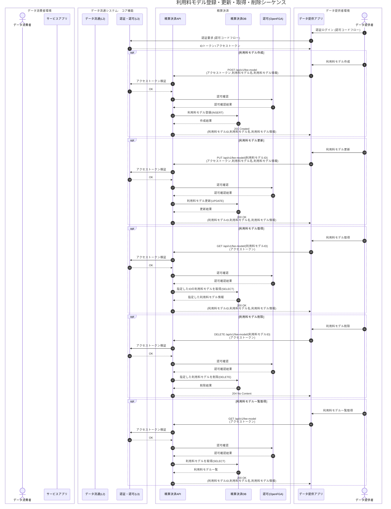
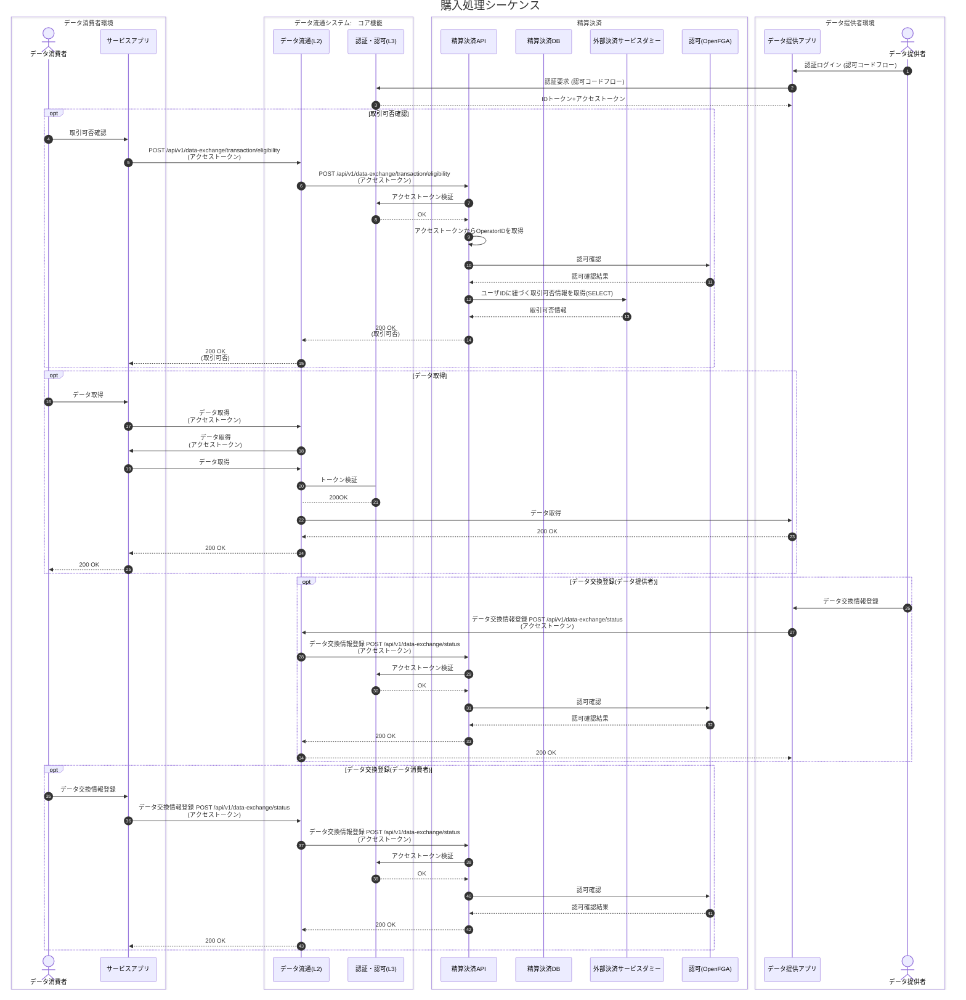
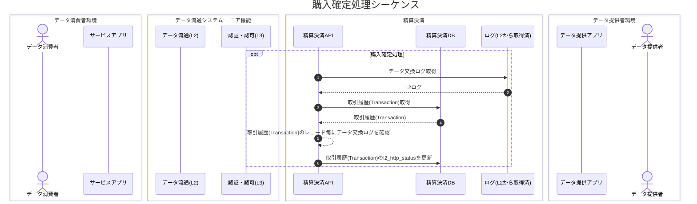
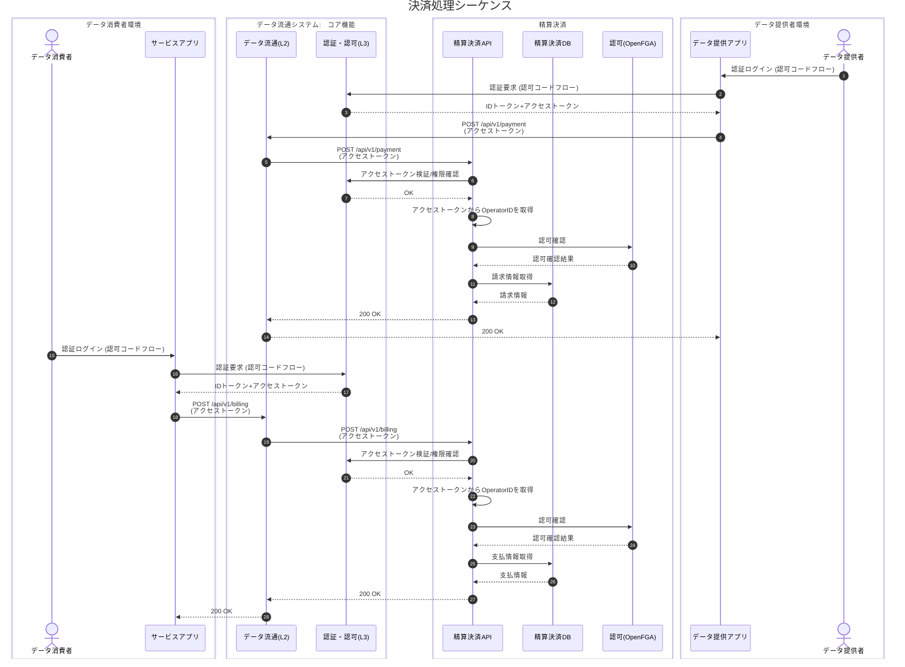
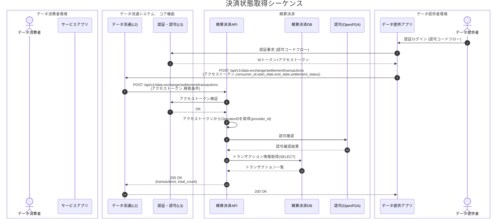
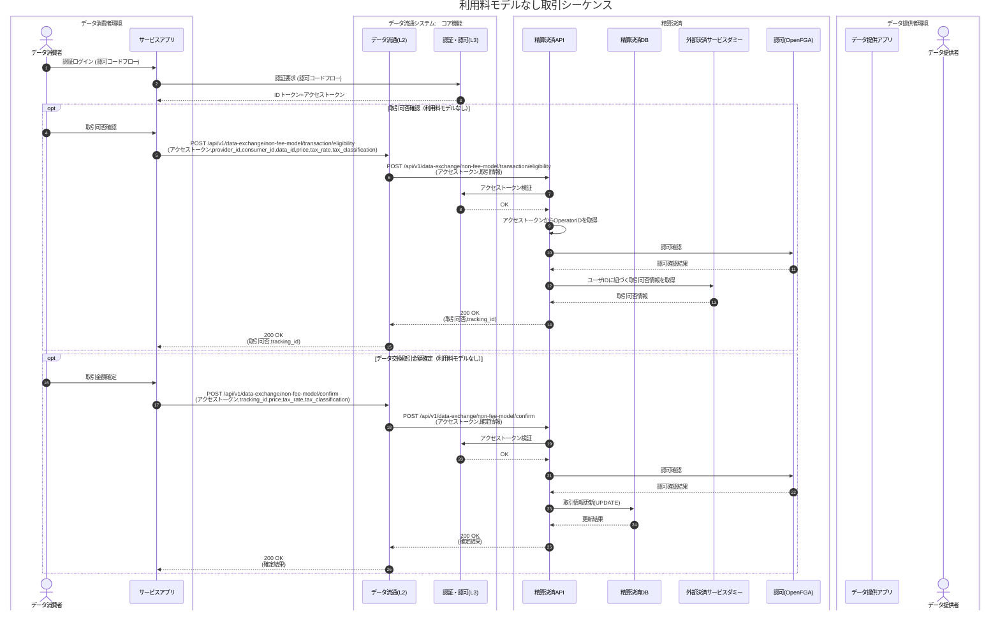

# 精算決済 詳細設計

## 1. 詳細シーケンス

### (1) 利用料モデル登録・更新・取得・削除シーケンス



### (2) 購入処理シーケンス



### (3) 購入確定処理シーケンス

- L2ログは精算決済側ログ格納場所に、定期的に格納されていることが前提



### (4) 決済処理シーケンス

- ※消費者データ交換ステータス、提供者データ交換ステータスが交換完了、L2ログステータスが成功しているTransactionを請求予定額、支払い予定額の対象とする。



### (5) 決済状態取得シーケンス

- データ提供者が、指定したデータ消費者の決済状態を含むトランザクション情報を取得する
- 期間指定・精算決済状態（settled/unsettled/cancelled）による絞り込みが可能



### (6) 利用料モデルなし取引シーケンス ※通常使用しないシーケンス




## 2. 詳細データベース
### 2.1 データベース詳細仕様
#### (1) 決済サービス `payment_services`

| カラム | 型 | 制約/既定値 | 説明 |
| --- | --- | --- | --- |
| payment_service_id | uuid | **PK**, DEFAULT gen_random_uuid() | 決済サービスID |
| payment_service_name | varchar(255) | **NOT NULL** | 決済サービス名 |
| payment_service_url | varchar(512) | **NOT NULL** | 決済サービスURL |
| created_at | timestamptz | **NOT NULL**, DEFAULT now() | 登録日時 |
| updated_at | timestamptz | **NOT NULL**, DEFAULT now() | 更新日時 |

```sql
CREATE TABLE IF NOT EXISTS payment_services (
  payment_service_id   uuid PRIMARY KEY DEFAULT gen_random_uuid(),
  payment_service_name varchar(255) NOT NULL,
  payment_service_url  varchar(512) NOT NULL,
  created_at           timestamptz NOT NULL DEFAULT now(),
  updated_at           timestamptz NOT NULL DEFAULT now()
);
```

---

#### (2) 利用料モデル `fee_models`

| カラム | 型 | 制約/既定値 | 説明 |
| --- | --- | --- | --- |
| fee_model_id | uuid | **PK**, DEFAULT gen_random_uuid() | 利用料モデルID |
| fee_model_name | varchar(255) | **NOT NULL** | 利用料モデル名 |
| price | numeric(15,2) | **NOT NULL** | 金額（マイナス値許容） |
| tax_classification | varchar(50) | **NOT NULL**, CHECK (IN ('taxable', 'non_taxable')) | 税区分(課税/非課税) |
| tax_rate | numeric(5,4) | **NOT NULL**, CHECK (tax_rate >= 0) | 税率 |
| provider_id | varchar(255) | **NOT NULL** | データ提供者ID(外部システム) |
| consumer_id | varchar(255) | **NOT NULL** | データ消費者ID(外部システム) |
| data_id | varchar(255) | **NOT NULL** | データID(外部システム) |
| payment_service_id | uuid | **NOT NULL**, **FK** → payment_services.payment_service_id | 決済サービスID |
| storage_type | varchar(100) | **NOT NULL**, CHECK (IN ('provider_env', 'settlement_service')) | 保管先タイプ |
| storage_key | varchar(512) | **NOT NULL** | 保管先識別子 |
| valid_from | timestamptz | **NOT NULL** | 有効開始日時 |
| valid_to | timestamptz | NULL, CHECK (valid_to IS NULL OR valid_to > valid_from) | 有効終了日時(NULL=現在有効) |
| is_active | boolean | **NOT NULL**, DEFAULT true | 現在有効フラグ |
| version | integer | **NOT NULL**, DEFAULT 1 | バージョン番号 |
| created_at | timestamptz | **NOT NULL**, DEFAULT now() | 登録日時 |
| updated_at | timestamptz | **NOT NULL**, DEFAULT now() | 更新日時 |

**インデックス:**
| インデックス名 | カラム | 種別 | 説明 |
| --- | --- | --- | --- |
| ix_fee_models_provider_id | provider_id | INDEX | 提供者ID検索用 |
| ix_fee_models_consumer_id | consumer_id | INDEX | 消費者ID検索用 |
| ix_fee_models_data_id | data_id | INDEX | データID検索用 |
| ix_fee_models_is_active | is_active | INDEX | 有効フラグ検索用 |
| ix_fee_model_provider_consumer_data | provider_id, consumer_id, data_id | INDEX | 複合検索用 |
| ix_fee_model_valid_period | valid_from, valid_to | INDEX | 有効期間検索用 |
| uq_fee_model_active | provider_id, consumer_id, data_id | UNIQUE (WHERE is_active = true) | アクティブモデル一意性制約 |

```sql
CREATE TABLE IF NOT EXISTS fee_models (
  fee_model_id         uuid PRIMARY KEY DEFAULT gen_random_uuid(),
  fee_model_name       varchar(255) NOT NULL,
  price                numeric(15,2) NOT NULL,
  tax_classification   varchar(50) NOT NULL,
  tax_rate             numeric(5,4) NOT NULL,
  provider_id          varchar(255) NOT NULL,
  consumer_id          varchar(255) NOT NULL,
  data_id              varchar(255) NOT NULL,
  payment_service_id   uuid NOT NULL REFERENCES payment_services(payment_service_id) ON DELETE RESTRICT,
  storage_type         varchar(100) NOT NULL,
  storage_key          varchar(512) NOT NULL,
  valid_from           timestamptz NOT NULL,
  valid_to             timestamptz NULL,
  is_active            boolean NOT NULL DEFAULT true,
  version              integer NOT NULL DEFAULT 1,
  created_at           timestamptz NOT NULL DEFAULT now(),
  updated_at           timestamptz NOT NULL DEFAULT now(),

  CONSTRAINT ck_tax_classification CHECK (tax_classification IN ('taxable', 'non_taxable')),
  CONSTRAINT ck_storage_type CHECK (storage_type IN ('provider_env', 'settlement_service')),
  CONSTRAINT ck_tax_rate_positive CHECK (tax_rate >= 0),
  CONSTRAINT ck_valid_period CHECK (valid_to IS NULL OR valid_to > valid_from)
);

-- インデックス
CREATE INDEX ix_fee_models_provider_id ON fee_models(provider_id);
CREATE INDEX ix_fee_models_consumer_id ON fee_models(consumer_id);
CREATE INDEX ix_fee_models_data_id ON fee_models(data_id);
CREATE INDEX ix_fee_models_is_active ON fee_models(is_active);
CREATE INDEX ix_fee_model_provider_consumer_data ON fee_models(provider_id, consumer_id, data_id);
CREATE INDEX ix_fee_model_valid_period ON fee_models(valid_from, valid_to);

-- 部分一意インデックス（アクティブなモデルの一意性）
CREATE UNIQUE INDEX uq_fee_model_active ON fee_models(provider_id, consumer_id, data_id) WHERE is_active = true;
```

---

#### (3) 利用料モデル履歴 `fee_model_history`

| カラム | 型 | 制約/既定値 | 説明 |
| --- | --- | --- | --- |
| fee_model_history_id | uuid | **PK**, DEFAULT gen_random_uuid() | 履歴ID |
| fee_model_id | uuid | **NOT NULL**, **FK** → fee_models.fee_model_id | 元のモデルID |
| fee_model_name | varchar(255) | **NOT NULL** | 利用料モデル名 |
| price | numeric(15,2) | **NOT NULL** | 金額 |
| tax_classification | varchar(50) | **NOT NULL** | 税区分 |
| tax_rate | numeric(5,4) | **NOT NULL** | 税率 |
| provider_id | varchar(255) | **NOT NULL** | データ提供者ID(外部システム) |
| consumer_id | varchar(255) | **NOT NULL** | データ消費者ID(外部システム) |
| data_id | varchar(255) | **NOT NULL** | データID(外部システム) |
| payment_service_id | uuid | **NOT NULL** | 決済サービスID |
| storage_type | varchar(100) | **NOT NULL** | 保管先タイプ |
| storage_key | varchar(512) | **NOT NULL** | 保管先識別子 |
| valid_from | timestamptz | **NOT NULL** | 有効開始日時 |
| valid_to | timestamptz | **NOT NULL** | 有効終了日時 |
| change_type | varchar(50) | **NOT NULL**, CHECK (IN ('create', 'update', 'delete', 'snapshot')) | 変更タイプ |
| change_reason | text | NULL | 変更理由 |
| version | integer | **NOT NULL** | バージョン番号 |
| created_at | timestamptz | **NOT NULL**, DEFAULT now() | 履歴記録日時 |

**インデックス:**
| インデックス名 | カラム | 種別 | 説明 |
| --- | --- | --- | --- |
| ix_fee_model_history_fee_model_id | fee_model_id | INDEX | モデルID検索用 |
| ix_fee_model_history_provider_id | provider_id | INDEX | 提供者ID検索用 |
| ix_fee_model_history_consumer_id | consumer_id | INDEX | 消費者ID検索用 |
| ix_fee_model_history_data_id | data_id | INDEX | データID検索用 |
| ix_fee_model_history_provider_consumer_data | provider_id, consumer_id, data_id | INDEX | 複合検索用 |
| ix_fee_model_history_created | created_at | INDEX | 時系列検索用 |
| ix_fee_model_history_model_type | fee_model_id, change_type | INDEX | モデル・変更タイプ検索用 |

```sql
CREATE TABLE IF NOT EXISTS fee_model_history (
  fee_model_history_id uuid PRIMARY KEY DEFAULT gen_random_uuid(),
  fee_model_id         uuid NOT NULL REFERENCES fee_models(fee_model_id) ON DELETE CASCADE,
  fee_model_name       varchar(255) NOT NULL,
  price                numeric(15,2) NOT NULL,
  tax_classification   varchar(50) NOT NULL,
  tax_rate             numeric(5,4) NOT NULL,
  provider_id          varchar(255) NOT NULL,
  consumer_id          varchar(255) NOT NULL,
  data_id              varchar(255) NOT NULL,
  payment_service_id   uuid NOT NULL,
  storage_type         varchar(100) NOT NULL,
  storage_key          varchar(512) NOT NULL,
  valid_from           timestamptz NOT NULL,
  valid_to             timestamptz NOT NULL,
  change_type          varchar(50) NOT NULL,
  change_reason        text NULL,
  version              integer NOT NULL,
  created_at           timestamptz NOT NULL DEFAULT now(),

  CONSTRAINT ck_change_type CHECK (change_type IN ('create', 'update', 'delete', 'snapshot'))
);

-- インデックス
CREATE INDEX ix_fee_model_history_fee_model_id ON fee_model_history(fee_model_id);
CREATE INDEX ix_fee_model_history_provider_id ON fee_model_history(provider_id);
CREATE INDEX ix_fee_model_history_consumer_id ON fee_model_history(consumer_id);
CREATE INDEX ix_fee_model_history_data_id ON fee_model_history(data_id);
CREATE INDEX ix_fee_model_history_provider_consumer_data ON fee_model_history(provider_id, consumer_id, data_id);
CREATE INDEX ix_fee_model_history_created ON fee_model_history(created_at);
CREATE INDEX ix_fee_model_history_model_type ON fee_model_history(fee_model_id, change_type);
```

---

#### (4) 決済サービスユーザ登録 `payment_service_user_registrations`

| カラム | 型 | 制約/既定値 | 説明 |
| --- | --- | --- | --- |
| payment_service_user_id | uuid | **PK**, DEFAULT gen_random_uuid() | 決済サービスユーザID |
| payment_service_id | uuid | **NOT NULL**, **FK** → payment_services.payment_service_id | 決済サービスID |
| consumer_id | varchar(255) | **NOT NULL** | データ消費者ID(外部システム) |
| provider_id | varchar(255) | **NOT NULL** | データ提供者ID(外部システム) |
| external_buyer_id | varchar(20) | NULL, INDEX | 外部購入企業ID |
| external_data | jsonb | NULL | 外部決済サービス固有データ |
| created_at | timestamptz | **NOT NULL**, DEFAULT now() | 登録日時 |
| updated_at | timestamptz | **NOT NULL**, DEFAULT now() | 更新日時 |

**インデックス:**
| インデックス名 | カラム | 種別 | 説明 |
| --- | --- | --- | --- |
| ix_payment_service_user_registrations_payment_service_id | payment_service_id | INDEX | 決済サービスID検索用 |
| ix_payment_service_user_registrations_consumer_id | consumer_id | INDEX | 消費者ID検索用 |
| ix_payment_service_user_registrations_provider_id | provider_id | INDEX | 提供者ID検索用 |
| ix_payment_user_external_buyer_id | external_buyer_id | INDEX | 外部購入企業ID検索用 |
| ix_payment_user_consumer_provider | consumer_id, provider_id | INDEX | 複合検索用 |
| uq_payment_user_registration | payment_service_id, consumer_id, provider_id | UNIQUE | 登録一意性制約 |

```sql
CREATE TABLE IF NOT EXISTS payment_service_user_registrations (
  payment_service_user_id uuid PRIMARY KEY DEFAULT gen_random_uuid(),
  payment_service_id      uuid NOT NULL REFERENCES payment_services(payment_service_id) ON DELETE RESTRICT,
  consumer_id             varchar(255) NOT NULL,
  provider_id             varchar(255) NOT NULL,
  external_buyer_id       varchar(20),
  external_data           jsonb,
  created_at              timestamptz NOT NULL DEFAULT now(),
  updated_at              timestamptz NOT NULL DEFAULT now(),

  CONSTRAINT uq_payment_user_registration UNIQUE (payment_service_id, consumer_id, provider_id)
);

-- インデックス
CREATE INDEX ix_payment_service_user_registrations_payment_service_id ON payment_service_user_registrations(payment_service_id);
CREATE INDEX ix_payment_service_user_registrations_consumer_id ON payment_service_user_registrations(consumer_id);
CREATE INDEX ix_payment_service_user_registrations_provider_id ON payment_service_user_registrations(provider_id);
CREATE INDEX ix_payment_user_external_buyer_id ON payment_service_user_registrations(external_buyer_id);
CREATE INDEX ix_payment_user_consumer_provider ON payment_service_user_registrations(consumer_id, provider_id);
```

---

#### (5) 取引 `transactions`

| カラム | 型 | 制約/既定値 | 説明 |
| --- | --- | --- | --- |
| transaction_id | uuid | **PK**, DEFAULT gen_random_uuid() | 取引ID |
| tracking_id | uuid | **NOT NULL**, INDEX | トラッキングID |
| external_transaction_id | varchar(20) | NULL, INDEX | 外部取引ID（外部決済サービスのレスポンスから取得） |
| fee_model_history_id | uuid | NULL, **FK** → fee_model_history.fee_model_history_id | 使用した履歴バージョンID(利用料モデル無しの場合NULL) |
| payment_service_user_id | uuid | NULL, **FK** → payment_service_user_registrations.payment_service_user_id | 決済サービスユーザID(利用料モデル無しの場合NULL) |
| provider_id | varchar(255) | **NOT NULL** | データ提供者ID(外部システム/検索キー) |
| consumer_id | varchar(255) | **NOT NULL** | データ消費者ID(外部システム/検索キー) |
| data_id | varchar(255) | NULL | データID(利用料モデル無しの場合NULL) |
| snapshot_price | numeric(15,2) | **NOT NULL** | スナップショット:金額 |
| snapshot_tax_rate | numeric(5,4) | **NOT NULL** | スナップショット:税率 |
| snapshot_tax_classification | varchar(50) | **NOT NULL** | スナップショット:税区分 |
| calculated_amount | numeric(15,2) | **NOT NULL** | 計算済金額(税込) |
| consumer_exchange_status | varchar(50) | **NOT NULL**, DEFAULT 'pending', CHECK (IN ('pending', 'completed', 'failed')) | 消費者データ交換ステータス |
| provider_exchange_status | varchar(50) | **NOT NULL**, DEFAULT 'pending', CHECK (IN ('pending', 'completed', 'failed')) | 提供者データ交換ステータス |
| l2_http_status | varchar(10) | **NOT NULL**, DEFAULT 'pending' | L2ログHTTPステータス(pending/HTTPステータスコード) |
| settlement_status | varchar(50) | **NOT NULL**, DEFAULT 'unsettled', CHECK (IN ('settled', 'unsettled', 'cancelled')) | 精算決済状態 |
| order_details | text | NULL | 注文内容 |
| request_date | timestamptz | NULL | 請求日 |
| payment_deadline | timestamptz | NULL, CHECK (>= request_date) | 支払期限 |
| paid_at | timestamptz | NULL | 支払完了日時 |
| external_data | jsonb | NULL | 外部決済サービス固有データ |
| created_at | timestamptz | **NOT NULL**, DEFAULT now() | 登録日時 |
| updated_at | timestamptz | **NOT NULL**, DEFAULT now() | 更新日時 |

**インデックス:**
| インデックス名 | カラム | 種別 | 説明 |
| --- | --- | --- | --- |
| ix_transactions_tracking_id | tracking_id | INDEX | トラッキングID検索用 |
| ix_transactions_external_transaction_id | external_transaction_id | INDEX | 外部取引ID検索用 |
| ix_transactions_fee_model_history_id | fee_model_history_id | INDEX | 履歴ID検索用 |
| ix_transactions_payment_service_user_id | payment_service_user_id | INDEX | 決済ユーザID検索用 |
| ix_transactions_provider_id | provider_id | INDEX | 提供者ID検索用 |
| ix_transactions_consumer_id | consumer_id | INDEX | 消費者ID検索用 |
| ix_transactions_data_id | data_id | INDEX | データID検索用 |
| ix_transactions_consumer_exchange_status | consumer_exchange_status | INDEX | 消費者ステータス検索用 |
| ix_transactions_provider_exchange_status | provider_exchange_status | INDEX | 提供者ステータス検索用 |
| ix_transactions_l2_http_status | l2_http_status | INDEX | L2ステータス検索用 |
| ix_transactions_settlement_status | settlement_status | INDEX | 精算決済状態検索用 |
| ix_transaction_provider_consumer_data | provider_id, consumer_id, data_id | INDEX | 複合検索用 |
| ix_transaction_request_date | request_date | INDEX | 請求日検索用 |

```sql
CREATE TABLE IF NOT EXISTS transactions (
  transaction_id               uuid PRIMARY KEY DEFAULT gen_random_uuid(),
  tracking_id                  uuid NOT NULL,
  external_transaction_id      varchar(20),
  fee_model_history_id         uuid REFERENCES fee_model_history(fee_model_history_id) ON DELETE RESTRICT,
  payment_service_user_id      uuid REFERENCES payment_service_user_registrations(payment_service_user_id) ON DELETE RESTRICT,
  provider_id                  varchar(255) NOT NULL,
  consumer_id                  varchar(255) NOT NULL,
  data_id                      varchar(255),
  snapshot_price               numeric(15,2) NOT NULL,
  snapshot_tax_rate            numeric(5,4) NOT NULL,
  snapshot_tax_classification  varchar(50) NOT NULL,
  calculated_amount            numeric(15,2) NOT NULL,
  consumer_exchange_status     varchar(50) NOT NULL DEFAULT 'pending',
  provider_exchange_status     varchar(50) NOT NULL DEFAULT 'pending',
  l2_http_status               varchar(10) NOT NULL DEFAULT 'pending',
  settlement_status            varchar(50) NOT NULL DEFAULT 'unsettled',
  order_details                text NULL,
  request_date                 timestamptz NULL,
  payment_deadline             timestamptz NULL,
  paid_at                      timestamptz NULL,
  external_data                jsonb,
  created_at                   timestamptz NOT NULL DEFAULT now(),
  updated_at                   timestamptz NOT NULL DEFAULT now(),

  CONSTRAINT ck_consumer_exchange_status CHECK (consumer_exchange_status IN ('pending', 'completed', 'failed')),
  CONSTRAINT ck_provider_exchange_status CHECK (provider_exchange_status IN ('pending', 'completed', 'failed')),
  CONSTRAINT ck_settlement_status CHECK (settlement_status IN ('settled', 'unsettled', 'cancelled')),
  CONSTRAINT ck_payment_deadline_after_request CHECK (payment_deadline IS NULL OR request_date IS NULL OR payment_deadline >= request_date)
);

-- インデックス
CREATE INDEX ix_transactions_tracking_id ON transactions(tracking_id);
CREATE INDEX ix_transactions_external_transaction_id ON transactions(external_transaction_id);
CREATE INDEX ix_transactions_fee_model_history_id ON transactions(fee_model_history_id);
CREATE INDEX ix_transactions_payment_service_user_id ON transactions(payment_service_user_id);
CREATE INDEX ix_transactions_provider_id ON transactions(provider_id);
CREATE INDEX ix_transactions_consumer_id ON transactions(consumer_id);
CREATE INDEX ix_transactions_data_id ON transactions(data_id);
CREATE INDEX ix_transactions_consumer_exchange_status ON transactions(consumer_exchange_status);
CREATE INDEX ix_transactions_provider_exchange_status ON transactions(provider_exchange_status);
CREATE INDEX ix_transactions_l2_http_status ON transactions(l2_http_status);
CREATE INDEX ix_transactions_settlement_status ON transactions(settlement_status);
CREATE INDEX ix_transaction_provider_consumer_data ON transactions(provider_id, consumer_id, data_id);
CREATE INDEX ix_transaction_request_date ON transactions(request_date);
```

---

### 2.2 テーブル関連性

| 親テーブル | 子テーブル | 関連性 | 外部キー | 削除時の動作 |
| --- | --- | --- | --- | --- |
| payment_services | fee_models | 1:N | payment_service_id | RESTRICT |
| payment_services | payment_service_user_registrations | 1:N | payment_service_id | RESTRICT |
| fee_models | fee_model_history | 1:N | fee_model_id | CASCADE |
| fee_model_history | transactions | 1:N | fee_model_history_id | RESTRICT |
| payment_service_user_registrations | transactions | 1:N | payment_service_user_id | RESTRICT |


## 3. ログ設計

### 3.1 設計思想
- **構造化ログ**: JSON形式での統一出力（本番環境）/ 人間可読形式（開発環境）
- **1行1JSON**: 各ログエントリは1行で完結し、改行文字を含まない
- **トレーサビリティ**: X-TrackingIdヘッダによる一連の処理追跡

### 3.2 ログ出力先

| 出力先 | 出力内容 | 形式 | 備考 |
|--------|----------|------|------|
| stdout | INFO以下のログ | JSON/テキスト | コンソールハンドラ |
| stderr | ERROR以上のログ | JSON/テキスト | エラーコンソールハンドラ |
| ファイル | 全ログ（任意） | JSON | LOG_FILE_ENABLED=true時 |

### 3.3 環境変数設定

| 環境変数 | デフォルト値 | 説明 |
|----------|-------------|------|
| LOG_LEVEL | INFO | ログレベル |
| LOG_JSON_FORMAT | true | JSON形式出力（本番向け） |
| LOG_FILE_ENABLED | false | ファイル出力有効化 |
| LOG_FILE_PATH | /var/log/app/app.log | ログファイルパス |
| ERROR_LOG_FILE_PATH | /var/log/app/error.log | エラーログファイルパス |
| LOG_FILE_MAX_BYTES | 10485760 | ローテーションサイズ（10MB） |
| LOG_FILE_BACKUP_COUNT | 5 | バックアップ世代数 |
| LOG_COLORIZE | true | カラー出力（開発環境向け） |
| APP_NAME | payment-api | アプリケーション名 |
| SQLALCHEMY_LOG_LEVEL | WARN | SQLAlchemyログレベル |
| UVICORN_LOG_LEVEL | INFO | Uvicornログレベル |

### 3.4 リクエストトレーシング

- **X-TrackingId**: リクエストヘッダから取得、レスポンスヘッダにも付与
- **TrackingMiddleware**: リクエスト/レスポンスのログ出力を担当
- **ContextVar**: スレッドセーフなリクエストID伝播

```python
# ログ出力例（サービス層）
logger.info(
    "Starting fee model creation",
    provider_id=request.provider_id,
    consumer_id=request.consumer_id,
    price=str(request.price)
)
```

### 3.5 JSONL ログ仕様

#### (1) 基本構造（JSON形式）
各ログエントリは以下の構造を持つ1行のJSONオブジェクト：

```json
{"timestamp":"2024-01-15T10:30:45.123Z","level":"INFO","logger":"app.services.fee_model","message":"Starting fee model creation","module":"fee_model_service","function":"create_fee_model","line":45,"thread":12345,"thread_name":"MainThread","app":{"name":"payment-api","environment":"production"},"request_id":"abc-123-def","provider_id":"provider_001","consumer_id":"consumer_001","price":"1000.00"}
```

#### (2) ログ出力仕様
- **改行文字の禁止**: ログメッセージ内の改行文字（\n, \r）はエスケープ（\\n, \\r）
- **スタックトレース**: 複数行のスタックトレースは1つの文字列内でエスケープ
- **JSONエスケープ**: 特殊文字は適切にエスケープ処理
- **UTF-8**: すべてのログはUTF-8エンコーディング
- **BOM無し**: Byte Order Markは使用しない

#### (3) 必須フィールド定義
| フィールド名 | 型 | 必須 | 説明 | 例 |
|--------------|----|----|------|-----|
| timestamp | string | ○ | ISO8601形式のタイムスタンプ | 2024-01-15T10:30:45.123Z |
| level | string | ○ | ログレベル | INFO, WARN, ERROR |
| logger | string | ○ | ロガー名（モジュールパス） | app.services.fee_model |
| message | string | ○ | ログメッセージ | Starting fee model creation |
| module | string | ○ | モジュール名 | fee_model_service |
| function | string | ○ | 関数名 | create_fee_model |
| line | number | ○ | 行番号 | 45 |

#### (4) アプリケーションフィールド
| フィールド名 | 用途 | データ型 | 例 |
|--------------|------|----------|-----|
| app.name | アプリケーション名 | string | payment-api |
| app.environment | 実行環境 | string | production |
| request_id | リクエスト追跡ID（X-TrackingId） | string | abc-123-def |

#### (5) コンテキストフィールド（オプション）
| フィールド名 | 用途 | データ型 | 例 |
|--------------|------|----------|-----|
| provider_id | データ提供者ID | string | provider_001 |
| consumer_id | データ消費者ID | string | consumer_001 |
| fee_model_id | 利用料モデルID | string | uuid |
| method | HTTPメソッド | string | POST |
| path | リクエストパス | string | /api/v1/fee-model |
| status_code | レスポンスコード | number | 201 |
| process_time_sec | 処理時間（秒） | number | 0.145 |
| error_type | エラー種別 | string | ValidationError |
| error_message | エラーメッセージ | string | Invalid format |

#### (6) 例外情報フィールド（エラー時）
| フィールド名 | 用途 | データ型 | 例 |
|--------------|------|----------|-----|
| exception.type | 例外クラス名 | string | ValueError |
| exception.message | 例外メッセージ | string | Invalid input |
| exception.traceback | スタックトレース | string | Traceback... |

#### (7) ログレベル定義

| レベル | 用途 | 出力条件 |
|--------|------|----------|
| DEBUG | 詳細なデバッグ情報 | 開発環境のみ |
| INFO | 正常な処理の記録 | 全環境 |
| WARNING | 注意が必要な状況 | 全環境 |
| ERROR | エラーが発生した状況 | 全環境 |
| CRITICAL | システム停止レベル | 全環境 |

### 3.6 ミドルウェアによるログ出力

#### TrackingMiddleware
| タイミング | レベル | 出力内容 |
|-----------|--------|----------|
| リクエスト受信 | INFO | method, path, client_host, tracking_id |
| レスポンス送信 | INFO | status_code, process_time_sec |

#### ErrorHandlerMiddleware
| エラー種別 | レベル | 出力内容 |
|-----------|--------|----------|
| ValidationError | WARNING | errors |
| ApplicationError | ERROR | error_code, message, exception_class, status_code |
| HTTPException | WARNING/ERROR | status_code, detail |
| DatabaseError | ERROR | error, traceback |
| 未処理例外 | ERROR | traceback |
